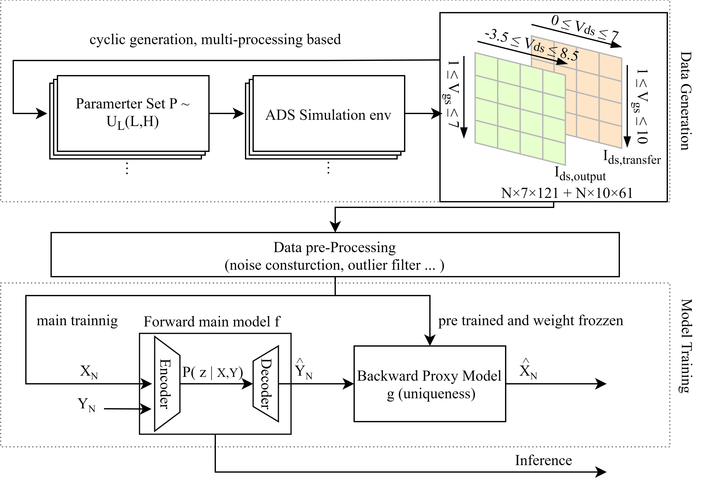

# DL-based ASM-HEMT Parameter Extractor

[](https://opensource.org/licenses/MIT)
[](https://www.python.org/downloads/)
[](https://pytorch.org/)

A deep learning-based framework for automatic parameter extraction of GaN ASM-HEMT physical models. This project utilizes neural networks to map electrical characteristics ($I-V$) to physical model parameters, overcoming the limitations of non-differentiable simulation environments, in meanwhile solving the key-feature of input sensitivity and non-uniqueness of ASM-HEMT parameter extraction.

---

## 📖 Table of Contents
- [DL-based ASM-HEMT Parameter Extractor](#dl-based-asm-hemt-parameter-extractor)
  - [📖 Table of Contents](#-table-of-contents)
  - [🧠 Background \& Methodology](#-background--methodology)
    - [Comparison of Different Methods](#comparison-of-different-methods)
  - [🏗 System Architecture](#-system-architecture)
  - [📂 Project Structure](#-project-structure)
  - [🛠 Installation](#-installation)
  - [🚀 Workflow \& Training](#-workflow--training)
  - [📊 Version History \& Performance](#-version-history--performance)
    - [Version History of only CNN + CVAE uni-directional Case](#version-history-of-only-cnn--cvae-uni-directional-case)
    - [Performance](#performance)
  - [🛠 Future Work](#-future-work)
  - [⚖️ License](#️-license)
  - [👥 Contact](#-contact)

---

## 🧠 Background & Methodology

In parameter extraction for ASM-HEMT models, the simulation environment (e.g., ADS) often acts as a **black box** because it doesn't support differential operations for backpropagation. 

### Comparison of Different Methods

| Method | Workflow | Pros | Cons |
| :--- | :--- | :--- | :--- |
| **Online Training (EA)** | CMA-ES / Genetic Algorithm | Easy to implement; no gradient needed. | Slow, no parallel support, prone to local minima. |
| **Reinforcement Learning** | Agent-Environment Interaction | Adaptive; no gradient needed. | High computational cost for parallel training. |
| **DL(Our Choice, CNN + CVAE)** | Large-scale Monte Carlo Data | **Fast inference; high accuracy via gradient descent, perfectly suits non-uniqueness and input-sensitivity.** | Requires large amounts of pre-simulated data. |

---

## 🏗 System Architecture

Basic workflow:
1. **Data Generation**: log-uniform based data generation connecting with ADS external Python Interface. Support multi-processing, process-monitor, matrix simulation.
2. **Data Pre-processing**: add specific noise in genrated smooth data, soft filter applied to remove outlier (non-monotonic, max/min constrains ...)
3. **Model Training**: Proxy model + Main model trainnig, including pure MLP model as baseline and CNN + CVAE based DL model, and advanced 2-stage fine-tuning strategy, also advanced infenrence strategy (BoK).

showed in figure:
<p align = "center">    

</p> 

Schematic of the CNN in 1-stage for feature extractor:
<p align = "center">    

</p> 

Schematic of CNN + CVAE architecture:
<p align = "center">    

</p> 

---
## 📂 Project Structure

```bash
├── NN_training/           # Core Neural Network architectures (CNN, CVAE)
├── data_gen/              # Scripts for generating data via ADS/Simulation interface (old version, just for reference)
├── data_gen_pro/          # Advanced data generation with physical constraints (new version for application)
├── data_pre_processing/   # Data cleaning, normalization, and H5 packaging
├── data_viewer/           # GUI/Scripts for Model performance diagnostic tools
└── README.md              # Project documentation
```

---
## 🛠 Installation

1. Clone the repository:
```bash
git clone https://github.com/CY-Nigora/DL-based-ASM-HEMT-Parameter-Extrctor.git
```
2. Install Dependencies:
```bash
pip install -r requirements.txt
```
3. Some additional packages of 3rd party (e.g. external Python interface of ADS) should be manually installed following correspondings tutorials.

---

## 🚀 Workflow & Training
**Model: CNN + CVAE based Uni/Bi-directional GaN HEMTs**
The model estimates 11/14 key parameters simultaneously.
Code files locate in path `NN_training\code\training\cvae_Bidi_CNN\main.py` or `NN_training\code\training\cvae_Unidi_CNN\main.py`. The path `pure_MLP_Bidi` and `pure_MLP_Bidi` are pure MLP models working as baseline. Specific paramters in following commands only work as example.

**Step 1: Proxy Training**
To train the proxy model (mapping parameters to curves):

```Bash
python code_file_path --data h5_dataset_file_path ^
  --train-proxy-only  --outdir output_path --proxy-hidden 512,512,512,512 --proxy-batch-size 1024^
  --proxy-lr 2.0e-4 --proxy-wd 5e-5 --proxy-patience 25 --proxy-epochs 180 
```

**Step 2: Parameter Extraction Training**
To train pure MLP based extractor (mapping curves back to parameters):

```Bash
python code_file_path --data h5_dataset_file_path ^
  --outdir output_path ^
  --hidden 1280,640,320 --batch-size 256 --lr 2.0e-4 ^
  --dropout 0.1 --weight-decay 1e-4 --max-epochs 300 --onecycle-epochs 300 --patience 100
```

To train CNN + CVAE based extractor (mapping curves back to parameters):

For 1-stage training:
```bash
python code_file_path --data h5_dataset_file_path ^
  --outdir output_path ^
  --proxy-run proxy_path ^
  --meas-h5 reference_measurement_small_h5_dataset_path ^
  --hidden 1280,640,320 --batch-size 256 --lr 2.5e-4 ^
  --feat-dim 256 ^
  --dropout 0.1 --weight-decay 1e-4 --max-epochs 300 --onecycle-epochs 300 --patience 100 ^
  --lambda-cyc-sim 10.0 --lambda-cyc-meas 0.1 --weight-iv 5.0 --weight-gm 1.0 --cyc-warmup-epochs 150 ^
  --sup-weight 1.0 --prior-l2 1.0e-2 --prior-bound 1e-2 --prior-bound-margin 0.05 ^
  --es-metric val_cyc_meas --es-min-delta 1e-5 ^
  --trust-alpha 1.0 --trust-alpha-meas 0.1 --trust-tau 1.0 ^
  --cyc-meas-knn-weight --cyc-meas-knn-gamma 0.8 ^
  --latent-dim 32 --kl-beta 0.5 ^
  --aug-prob 0.5 --aug-noise-std 0.015 ^
  --best-of-k 0 --cnn-dropout 0.1 ^
  --diag --z-sample-mode mean --phys-loss
```

For 2-stage fine-turning:
```bash
python code_file_path --data h5_dataset_file_path ^
  --outdir output_path ^
  --proxy-run proxy_path ^
  --meas-h5 reference_measurement_small_h5_dataset_path ^
  --resume 1stage_result_named::best_model.pt ^
  --hidden 1280,640,320 --batch-size 256 --lr 1.5e-5 ^
  --feat-dim 256 ^
  --dropout 0.0 --weight-decay 1e-4 --max-epochs 300 --onecycle-epochs 300 --patience 100 ^
  --lambda-cyc-sim 0.1 --lambda-cyc-meas 10.0 --weight-iv 5.0 --weight-gm 1.0 --cyc-warmup-epochs 150 ^
  --sup-weight 1.0 --prior-l2 1.0e-2 --prior-bound 1e-2 --prior-bound-margin 0.05 ^
  --es-metric val_cyc_meas --es-min-delta 1e-5 ^
  --trust-alpha 1.0 --trust-alpha-meas 0.1 --trust-tau 1.0 ^
  --cyc-meas-knn-weight --cyc-meas-knn-gamma 0.8 ^
  --latent-dim 32 --kl-beta 0.05 ^
  --aug-prob 0.0 --aug-noise-std 0.015 ^
  --best-of-k 0 --cnn-dropout 0.0 ^
  --diag --z-sample-mode mean --phys-loss
```

**Inference Command:**

Inference of Proxy model:
```bash
python code_file_path ^
  --infer-proxy-run proxy_path ^
  --proxy-input-h5 h5_dataset_file_path ^
  --proxy-index index_number ^
  --save-xhat-npy xhat.npy
```

Inference of main model:
```bash
python code_file_path ^
--infer-run model_father_folder_path,
--input-h5 inference_data_path,
--index inference_data_index, # if ignored, then inference all data in input data file
--save-csv output_csv_path,
--sample-mode cvae_mode, # `rand` / `mean`
--num-samples 1000 # number of sampling from latent space
--dropout-infer # if used, then use same dropout rate during training, which is saved in model`s local configuration files
```

TTO based Inference of CNN + CVAE model:
```bash
python code_file_path ^
  --cvae-run model_father_folder_path ^
  --proxy-run proxy_path ^
  --meas-h5 inference_h5_data_path ^
  --save-to output_csv_path ^
  --steps 1000 --lr 0.05
```
---
## 📊 Version History & Performance

Best Model location，navigate to path:
1. CNN + CVAE based unidirectional GaN HEMTs : `NN_training\model\cvae_Unidi_14param_2channel\version_2_4`
2. Baseline of unidirectional GaN HEMTs : `NN_training\model\Unidi_pureMLP_2channel_baseline`
3. CNN + CVAE based bi-directional GaN HEMTs : `NN_training\model\cvae_Bidi_11param_2channel\version_1_3`
4. Baseline of bidirectional GaN HEMTs : `NN_training\model\Bidi_pureMLP_2channel_baseline`

### Version History of only CNN + CVAE uni-directional Case
**version 1.x : hybrid/cnn based**
<font color=red> Conclusion: </font> dropout is necessary, physical stats are useless !
<table>
  <tr style="background-color: #f2f2f2;">
    <th><strong>Parameter</strong></th>
    <th><strong>version-1.1</strong></th>
    <th><strong>version-1.2</strong></th>
    <th><strong>version-1.3</strong></th>
    <th><strong>version-1.4</strong></th>
    <th><strong>version-1.5</strong></th>
    <th><strong>version-1.6</strong></th>
  </tr>
  </tr>
    <tr>
    <td>Adjustment</td>
    <td>default config, use_stats::OFF</td>
    <td>default config, use_stats::ON </td>
    <td>change 3*3 default cnn kern to (3,12) & (3,6), use_stats::OFF</td>
    <td>same as version 1.3, dropout = 0</td>
    <td>change 3*3 default cnn kern to (3,12) & (3,6), use_stats::ON</td>
    <td>same as version 1.5, dropout = 0</td>
  </tr>
  </tr>
    <tr>
    <td>epoch</td>
    <td>  52/300 </td>
    <td>  58/300 </td>
    <td>  102/300 </td>
    <td>  44/300 </td>
    <td>  87/300 </td>
    <td>  47/300 </td>
  </tr>
  </tr>
    <tr>
    <td>cyc_sim_prior</td>
    <td> 0.182 </td>
    <td> 0.182 </td>
    <td> 0.146 </td>
    <td> 0.633 </td>
    <td style="color: #ff0000;"> 0.132 </td>
    <td> 0.523 </td>
  </tr>
  </tr>
    <tr>
    <td>cyc_meas</td>
    <td> 0.261 </td>
    <td> 0.203 </td>
    <td style="color: #ff0000;"> 0.185 </td>
    <td> 0.238 </td>
    <td> 0.209 </td>
    <td> 0.225 </td>  
  </tr>
</tr>
    <tr>
    <td>nMAE<br>N samplings based</td>
    <td>  </td>
    <td>  </td>
    <td>  </td>
    <td>  </td>
    <td>  </td>
    <td>  </td>
  </tr>
</table>


**version 2.x : MLP based encoder**
<font color=red> Conclusion: </font> dropout + MLP + pysical states help for better performance
<table>
  <tr style="background-color: #f2f2f2;">
    <th><strong>Parameter</strong></th>
    <th><strong>version-2.1</strong></th>
    <th><strong>version-2.2</strong></th>
    <th><strong>version-2.3</strong></th>
    <th><strong>version-2.4</strong></th>
    <th><strong>version-2.5</strong></th>
    <th><strong>version-2.6</strong></th>
  </tr>
  </tr>
    <tr>
    <td>Adjustment</td>
    <td>defult config but MLP<br>default iv/gm wight of 1/1<br></td>
    <td>iv/gm wight of 5/1<br>patience->80<br>bigger hidden layer 2048,1024,512 </td>
    <td>iv/gm wight of 2/1<br>patience->80</td>
    <td>iv/gm wight of 5/1<br>patience->80</td>
    <td>iv/gm wight of 0.5/1<br>patience->80</td>
    <td>iv/gm wight of 1/1<br>patience->80<br>dropout(both)->0.2</td>
  </tr>
  </tr>
    <tr>
    <td>epoch</td>
    <td>  111/300 </td>
    <td>  111/300 </td>
    <td>  164/300 </td>
    <td>  300/300 </td>
    <td>  119/300 </td>
    <td>  126/300 </td>
  </tr>
  </tr>
    <tr>
    <td>cyc_sim_prior</td>
    <td> 1.272 </td>
    <td> 2.874 </td>
    <td> 2.476 </td>
    <td> 2.293 </td>
    <td> 1.563 </td>
    <td> 0.918 </td>
  </tr>
  </tr>
    <tr>
    <td>cyc_meas</td>
    <td> 0.0492 </td>
    <td> 0.409 </td>
    <td> 0.101 </td>
    <td> 0.106 </td>
    <td> 0.0291 </td>
    <td> 0.0390 </td>  
  </tr>
</tr>
    <tr>
    <td>nMAE<br>N samplings based</td>
    <td style="color: #ff0000;">best 2  </td>
    <td>  </td>
    <td>  </td>
    <td style="color: #ff0000;">best 1   </td>
    <td>  </td>
    <td>  </td>
  </tr>
</table>

**version 2.7 - version 2.10:**
<strong><font color=red> FIX </font> :: print real cyc_loss without multiplied weight iv/gm, otherwise loss print will be polutted</strong>

<table>
  <tr style="background-color: #f2f2f2;">
    <th><strong>Parameter</strong></th>
    <th><strong>version-2.7</strong></th>
    <th><strong>version-2.8</strong></th>
    <th><strong>version-2.9</strong></th>
    <th><strong>version-2.10</strong></th>
  </tr>
  </tr>
    <tr>
    <td>Adjustment</td>
    <td>iv/gm wight of 5/1<br>patience->100<br>max epoch->500</td>
    <td>iv/gm wight of 5/1<br>patience->80<br>dropout(both)->0.2</td>
    <td>iv/gm wight of 7/1<br>patience->80</td>
    <td>iv/gm wight of 10/1<br>patience->80</td>
  </tr>
  </tr>
    <tr>
    <td>epoch</td>
    <td>  300/300 </td>
    <td>  207/300 </td>
    <td>  203/300 </td>
    <td>  150/300 </td>
  </tr>
  </tr>
    <tr>
    <td>cyc_sim_prior</td>
    <td> 0.838 </td>
    <td> 0.782 </td>
    <td> 0.823 </td>
    <td> 1.077 </td>
  </tr>
  </tr>
    <tr>
    <td>cyc_meas</td>
    <td> 0.0344 </td>
    <td> 0.0441 </td>
    <td> 0.0740 </td>
    <td> 0.116 </td> 
  </tr>
</tr>
    <tr>
    <td>nMAE<br>N samplings based</td>
    <td>  </td>
    <td>  </td>
    <td>  </td>
    <td>  </td>
  </tr>
</table>


**version 2.11 - version 2.15:**
<strong><font color=red> FIX </font> :: use bigger training dataset</strong>
<font color=red> Conclusion: </font> seems like 1-stage training already reaches to the performance cell, the do 2-stage training in version 3
<table>
  <tr style="background-color: #f2f2f2;">
    <th><strong>Parameter</strong></th>
    <th><strong>version-2.11</strong></th>
    <th><strong>version-2.12</strong></th>
    <th><strong>version-2.13</strong></th>
    <th><strong>version-2.14</strong></th>
    <th><strong>version-2.15</strong></th>
  </tr>
  </tr>
    <tr>
    <td>Adjustment</td>
    <td>iv/gm wight of 5/1<br>patience->100</td>
    <td>new physical loss - only iv<br>iv/gm wight of 5/1<br>patience->100<br>lambda_phys_sim/lambda_phys_meas=2/1(only iv)</td>
    <td>new physical loss - iv/gm<br>iv/gm wight of 5/1<br>patience->100<br>lambda_phys_sim/lambda_phys_meas=2/1(only iv)</td>
    <td>iv/gm wight of 5/1<br>patience->100<br>reduced weight of physical feature->avoid broken<br>lr=1.7e-4</td>
    <td>iv/gm wight of 5/1<br>patience->100<br>reduced weight of physical feature->avoid broken<br>lr=1.9e-4</td>
  </tr>
  </tr>
    <tr>
    <td>epoch</td>
    <td>  233/300 </td>
    <td>  193/300 </td>
    <td>  300/300 </td>
    <td>  188/300 </td>
    <td>  139/300 </td>
  </tr>
  </tr>
    <tr>
    <td>cyc_sim_prior</td>
    <td> 0.674 </td>
    <td> 0.551 </td>
    <td> 0.522 </td>
    <td> 0.662 </td>
    <td style="color: #ff0000;"> 0.324 </td>
  </tr>
  </tr>
    <tr>
    <td>cyc_meas</td>
    <td> 0.0230 </td>
    <td style="color: #ff0000;"> 0.0218 </td>
    <td> 0.0691 </td>
    <td> 0.0299 </td> 
    <td> 0.0253 </td> 
  </tr>
</tr>
    <tr>
    <td>nMAE<br>N samplings based</td>
    <td>  </td>
    <td>15.1%/7.9%</td>
    <td style="color: #ff0000;"> 12.3%/5.2% </td>
    <td></td>
  </tr>
</table>

*weired infer result in **version 2.15**: stange large knee during inference: not really limited by physical feature but gernerally not bad*

### Performance

Regression result of uni-directional GaN HEMTs:
<p align = "center">    

</p> 

Regression result of bi-directional GaN HEMTs:
<p align = "center">    

</p> 

---
## 🛠 Future Work

1. 14 -> 15 ASM-HEMT, take self-heating effect also into consideration
2. Besides static I-V chracteristic also dynamic C-V chractersitic into consideration : more parameters and higher input dimensions.
3. Correcte an advanced bi-directional GaN HEMTs model, updated based on ASM-HEMT model, considering more parasistic components and coupling impacts. In meanwhile supplement the influence of leakage current in common substrate during both measuremnt and simulation. 
4. Try to simulate and verify unsymmetric rather than symmetric configurations in bi-directional GaN HEMTs.


---

## ⚖️ License
This project is licensed under the MIT License - see the LICENSE file for details.

---

## 👥 Contact
Created by CY-Nigora (github).
